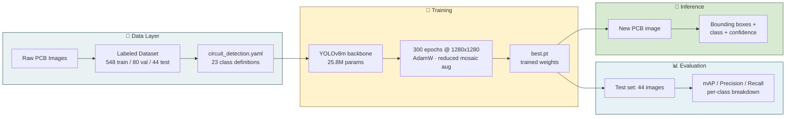

<div align="center">

# 🔍 PCB Component Detection with YOLOv8

### Teaching a neural network to "read" a circuit board the way an engineer does


</div>

---

## 🧩 The Problem

A single circuit board can carry **hundreds of tiny components** — resistors, capacitors, ICs, connectors, switches — packed together in a few square inches. Manually identifying and counting them is slow and error-prone.

**Goal:** train a computer vision model that looks at a photo of a PCB and automatically draws a box around every component, labeling what it is.

```
📷 Raw PCB photo  ──────▶  🧠 YOLOv8 model  ──────▶  📦 Labeled components + confidence scores
```

---

## 🏗️ Architecture

The system is a straightforward **train → evaluate → infer** pipeline built around a YOLOv8m detector.



**Why YOLOv8?** Single-pass detection (no separate region-proposal step) means it's fast enough for real-time inspection (~96ms/image) while still being accurate enough to fine-tune on a small custom dataset.

**Why 1280px instead of the default 640px?** Many components — resistors especially — are only a handful of pixels wide. Doubling the input resolution was the single biggest lever for making them visible to the network at all.

---

## 📖 The Story So Far

| Stage | mAP@0.5 | What changed |
|---|---|---|
| 🟥 Baseline (YOLOv8n, 100 epochs, 640px) | 19.2% | First working pipeline |
| 🟧 Improved (YOLOv8m, 200 epochs, 640px) | 35.0% | Bigger model, more training |
| 🟩 **Ultimate (YOLOv8m, 300 epochs, 1280px)** | **42.6%** | High-res input + tuned augmentation |

> **+122% improvement** from first working baseline to final model.

---


## 🎯 Per-Class Performance

```
Switch                 ████████████████░░░░  82.4%   🟢 Excellent
EM                      ███████████████░░░░░  76.1%   🟢 Excellent
Diode                   ██████████████░░░░░░  71.0%   🟢 Good
Electrolytic Capacitor  █████████████░░░░░░░  64.6%   🟢 Good
Connector               ██████████░░░░░░░░░░  51.8%   🟡 Moderate
IC                      ████████░░░░░░░░░░░░  40.6%   🟡 Moderate
Resistor                ██░░░░░░░░░░░░░░░░░░   8.9%   🔴 Poor
Resistor Network        █░░░░░░░░░░░░░░░░░░░   5.5%   🔴 Poor
```

**The pattern:** large, visually distinct components (switches, ICs, electrolytic caps) are learned easily. Small, densely-packed, visually-similar components (resistors, resistor networks, jumpers) are the hard part — this is a resolution and dataset-size problem, not a model problem. Full breakdown in [`results/training_report.txt`](results/training_report.txt).

---


## 🗂️ Dataset at a Glance

| | |
|---|---|
| Classes | 23 (Button, Capacitor, Capacitor Jumper, Clock, Connector, Diode, EM, Electrolytic Capacitor, Ferrite Bead, IC, Inductor, Jumper, Led, Pads, Pins, Resistor, Resistor Jumper, Resistor Network, Switch, Test Point, Transistor, Unknown Unlabeled, iC) |
| Train / Val / Test | 548 / 80 / 44 images |
| Annotated instances | 18,602 (validation split) |
| Resolution | 1280 × 1280 |

---


# PCB-Component-Detection-YOLOv8

Automated detection and classification of electronic components (resistors, capacitors, ICs, connectors, switches, etc.) on printed circuit board (PCB) images, using a fine-tuned YOLOv8 model.

**Status:** Completed (internship project) — 23/23 classes trained, model detects components on unseen test images with 42.6% mAP@0.5.

## Overview

| | |
|---|---|
| **Model** | YOLOv8m (25.8M params) |
| **Input resolution** | 1280 × 1280 |
| **Classes** | 23 |
| **Training set** | 548 images |
| **Epochs** | 300 (8.1 hrs on Tesla T4) |
| **mAP@0.5** | 42.6% |
| **Precision / Recall** | 51.4% / 47.5% |
| **Inference speed** | ~96 ms/image |

See [`docs/PCB_Component_Detection_Report.pdf`](docs/PCB_Component_Detection_Report.pdf) for the full write-up, methodology, per-class results, and sample detections.

## Dataset

23 component classes: Button, Capacitor Jumper, Capacitor, Clock, Connector, Diode, EM,
Electrolytic Capacitor, Ferrite Bead, IC, Inductor, Jumper, Led, Pads, Pins, Resistor Jumper,
Resistor Network, Resistor, Switch, Test Point, Transistor, Unknown Unlabeled, iC.

548 train / 80 valid / 44 test images, 18,602 annotated instances (validation split).

## Results Summary

| Component Class | mAP@0.5 |
|---|---|
| Switch | 82.4% |
| EM | 76.1% |
| Diode | 71.0% |
| Electrolytic Capacitor | 64.6% |
| Connector | 51.8% |
| IC | 40.6% |
| Resistor | 8.9% |
| Resistor Network | 5.5% |

Full per-class breakdown in [`results/training_report.txt`](results/training_report.txt) and the [project report](docs/PCB_Component_Detection_Report.pdf).


 ## Results Detection


 
---

## 📄 Full Report

The complete write-up — methodology, all per-class metrics, and full-size detection images — is in [`docs/PCB_Component_Detection_Report.pdf`](docs/PCB_Component_Detection_Report.pdf).

## 📜 License

MIT — see [`LICENSE`](LICENSE).
